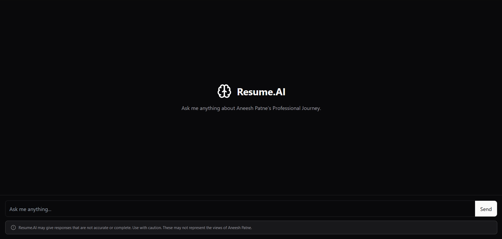

# Resume.AI

A chatbot system that uses Retrieval-Augmented Generation (RAG) and LLAMA 3.2 1B model to create an interactive resume experience.

## Overview

Resume.AI is an intelligent chatbot that provides accurate, contextual responses about professional experience by combining:

- LLAMA 3.2 1B language model and Mistral:Latest 8B.
- RAG (Retrieval-Augmented Generation) for grounding responses in actual resume data
- Natural language processing for human-like interactions

## Features

- Interactive Q&A about professional experience
- Context-aware responses using RAG
- Accurate information retrieval from resume data
- Natural conversational interface
- Support for diverse professional queries

## Demo

{width=600 height=400}

_Interactive chat interface demonstrating Resume.AI capabilities_

## Project Structure

```
.
├── Chat/                         # Main chat implementation
│   └── Vector Database/         # Vector DB for RAG
├── Extraction and Upserting/    # Data processing scripts
│   ├── extraction.ipynb
│   └── conversion.ipynb
└── README.md
```

## Setup and Installation

1. Clone the repository

   ```bash
   git clone https://github.com/username/Resume.AI.git
   ```

2. Install dependencies

   ```bash
   pip install -r requirements.txt
   ```

3. Configure environment variables in `.env`

4. Run the chat interface
   ```bash
   python chat/main.py
   ```

## Data Preparation

Training data includes prompt-response pairs covering:

- Work history and experience
- Technical skills and competencies
- Educational background
- Project details and achievements
- Professional certifications

## Development

- Uses LLAMA 3.2 1B model fine-tuned on resume data
- Implements RAG for retrieval-augmented generation
- Indexes resume content in vector database
- Processes natural language queries
